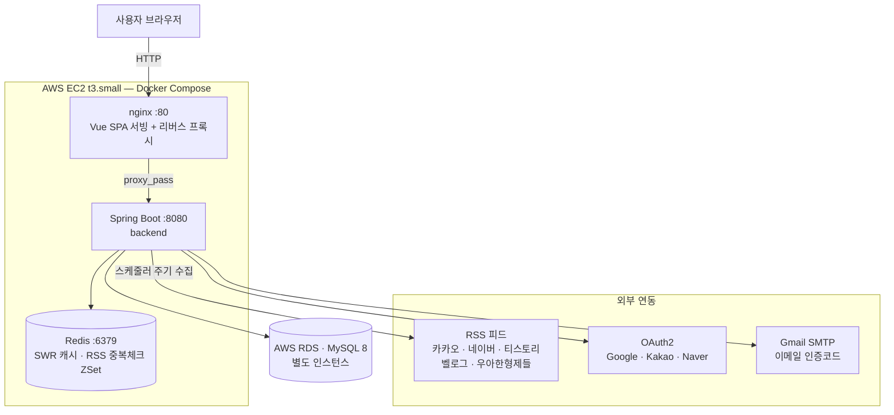
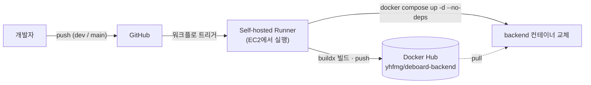

# DeboardV2

RSS 기반 기술 블로그 구독 플랫폼. 여러 기술 블로그의 글을 여기저기 찾아다니며 읽는 게 불편해서, 등록한 블로그의 RSS 피드를 주기적으로 수집해 한곳에서 모아 볼 수 있는 서비스를 직접 만들었습니다. 좋아요·댓글·검색을 제공하는 1인 개발 프로젝트입니다.

단순 CRUD를 넘어 **1,000만 건 데이터 기준의 조회 성능 최적화, 동시성 제어, 대량 수집 파이프라인**을 직접 측정하고 개선한 과정을 기록하는 데 중점을 두었습니다.

- **개발 기간**: 2025.08 ~ (개선 진행 중)
- **배포**: AWS EC2 + RDS 운영 경험 (현재는 중단, 재배포 예정)

## Tech Stack

| 구분 | 기술 |
|------|------|
| Language / Framework | Java 21, Spring Boot 3.5 |
| Auth | Spring Security, JWT, OAuth2 (Google / Kakao / Naver) |
| Data | MySQL(RDS), Spring Data JPA, QueryDSL, JdbcTemplate(배치) |
| Cache | Redis (SWR 캐시, 분산락, 중복 수집 방지 ZSet), Caffeine |
| Infra | Docker, AWS EC2 + RDS, GitHub Actions(Self-hosted Runner, dev/prod 분리 배포) |
| Monitoring | Prometheus, Grafana, Loki, Spring Actuator, datasource-proxy |
| Load Test | k6 |

## 주요 기능

- **RSS 수집 파이프라인** — 스케줄러가 등록된 피드를 주기적으로 수집. 가상 스레드(네트워크 I/O)와 플랫폼 스레드풀(파싱·저장)을 분리하고, JDBC 배치 INSERT와 Redis ZSet 기반 중복 체크로 처리
- **게시글 피드** — 공개/비공개 가시성 제어, 비로그인/로그인 경로 분리, two-phase fetch(ID 선조회) 기반 오프셋 페이징
- **소셜 로그인** — Google / Kakao / Naver OAuth2 + JWT 발급
- **좋아요 / 댓글 / 검색**
- **운영 모니터링** — 쿼리 카운트 측정, MDC 구조화 로깅(Loki), Prometheus 메트릭 + Grafana 대시보드

## 성능 개선 기록

측정 환경: EC2 t3.small, 게시글 1,000만 건, k6 VUS 100
([1,000만 건 데이터 구축 방법](docs/dummy-data.md))

아래 수치는 모두 실제 측정값이며, **측정 과정·실행 계획·중간 실패까지 문서로 남겼습니다.**
각 항목의 상세 기록은 링크된 문서에서 확인하실 수 있습니다.

### 1. 게시글 목록 조회 (비로그인 경로)

| 단계 | 변경 | p95 | RPS |
|------|------|-----|-----|
| 베이스라인 | — | 31.62s | 5.7/s |
| 인덱스 개선 | OR 조건 제거 + 복합 인덱스 | 2.39s | 36.6/s |
| SWR 캐시 | 첫 페이지 Redis Stale-While-Revalidate | 46ms | 79.8/s |
| count 쿼리 개선 | `fetch().size()` 제거 + LIMIT 서브쿼리 | 2.33s | 38.4/s |
| RDS 분리 | 앱/DB 리소스 격리 | **514ms** | **62/s** |

**p95 31.62s → 514ms (61배), RPS 10.8배** / 힙 사용률 91.8% → 25.7%, CPU 100% → 55.6%

> 상세 기록: [docs/query-perf-v2.md](docs/query-perf-v2.md)

### 2. 게시글 목록 조회 (로그인 경로)

베이스라인은 깊은 페이지(page=1000)에서 **에러율 85.3%로 서버 다운**.

| 단계 | 변경 | p95 (page=1000) | 에러율 |
|------|------|------|------|
| 베이스라인 | — | 59.58s | 85.3% |
| two-phase fetch + 인덱스 | ID 선조회 후 본문 조회 | 3.94s | 0% |
| Redis 캐싱 | feedIds + privateCount TTL 캐시 | 4.27s | 21% (page=10000) |
| UNION ALL DB 이관 | 애플리케이션 병합 → DB 병합 (JdbcTemplate) | **194ms** | **0%** |

핵심: `IN` 절 10만 개 → 10개, LONGTEXT 수백 MB 전송 제거, 쿼리 5회 → 3회

RDS CPU는 5.45%인데 서버가 죽는 원인을 추적한 결과, 병목은 DB가 아니라 **애플리케이션 힙에 적재된
약 200만 개의 객체와 그로 인한 GC(Minor GC STW 275ms @ 6.6회/s)** 였습니다.
병합 위치를 애플리케이션에서 DB로 옮겨 적재량 자체를 줄이는 것으로 해결했습니다.

> 상세 기록: [docs/query-perf-v3.md](docs/query-perf-v3.md)

### 3. 좋아요 동시성 제어

- Dirty checking은 100명 동시 요청 시 likeCount가 6으로 유실 → `@Modifying` 원자적 UPDATE로 100/100 일치
- FK INSERT의 shared lock → posts exclusive lock 순환 대기로 발생한 **데드락**을 락 획득 순서 조정(posts UPDATE 선행)으로 해결
- 낙관적 락 / 비관적 락 / `@Modifying` / Redis 분산락 4가지 방식을 동시성 테스트로 직접 비교

### 4. RSS 수집 최적화

- 1,400건 수집 기준 12.7s → 9.0s (29% 개선)
- 단건 INSERT 1,400회 → 배치 INSERT, 피드별 SELECT 수백 회 → 캐시로 제거
- 가상 스레드(수집)와 플랫폼 스레드풀(저장)을 분리해 **동시 DB 접근 수의 상한을 고정**.
  HikariCP 풀(20)보다 스레드 수(40)가 많으므로 이 구조가 보장하는 것은 "고갈 방지"가 아니라
  **대기 큐 길이의 예측 가능성**이며, 가상 스레드에서 무제한으로 몰릴 때 발생하던 Connection timeout이 해소됐습니다
- JDBC Batch를 먼저 적용했을 때 속도가 거의 안 줄어든 것으로 **DB가 병목이 아님**을 먼저 확인한 뒤,
  비동기 전환으로 외부 HTTP I/O가 주 병목임을 규명했습니다

> 상세 기록: [docs/rss-scheduler.md](docs/rss-scheduler.md)

## 시스템 아키텍처

애플리케이션은 EC2 위에서 Docker Compose로 운영하고, **DB는 RDS로 분리**했습니다.
프론트엔드(Vue)는 nginx 컨테이너가 정적 서빙하면서 `/api`, `/oauth2` 요청을 백엔드로 리버스 프록시합니다.



> DB를 EC2 내부 컨테이너에서 RDS로 분리해 앱과 DB의 리소스 경합을 제거했습니다.
> 1,000만 건 기준 조회 성능 측정에서 이 분리만으로 p95가 2.33s → 514ms로 개선됐습니다.

### 배포 파이프라인

EC2 자체를 GitHub Actions Self-hosted Runner로 등록해, 러너가 배포 대상 서버 위에서 직접 실행됩니다.
별도의 SSH 접속이나 배포 키 없이 브랜치 push만으로 배포가 완료됩니다.



- `dev` 브랜치 → dev 서버 / `main` 브랜치 → prod 서버로 러너 라벨을 분리
- 레지스트리 빌드 캐시(`:buildcache`)로 빌드 시간 단축, 배포 전후 이미지·빌더 정리로 디스크 확보

## 프로젝트 구조

```
org.example.deboardv2
├── user/      # 인증, JWT, OAuth2
├── post/      # 게시글 피드 (가시성 제어, 캐시)
├── comment/   # 댓글
├── likes/     # 좋아요 (동시성 제어)
├── rss/       # RSS 수집 파이프라인
├── search/    # 검색
├── redis/     # Redis 캐시 추상화
└── system/    # 설정, 예외, 로깅, 쿼리 모니터링, 스케줄러
```

- 레이어드 구조: Controller → Service(인터페이스 + Impl) → Repository → Entity
- 복잡한 조회는 QueryDSL(`*CustomRepository`), 배치 저장은 JDBC(`*JdbcRepository`)로 분리

## 실행 방법

**사전 준비:** Java 21, MySQL(`localhost:3306`, DB `deboard`), Redis(`localhost:6379`)

```bash
# .env.example 참고해 .env 작성 (DB, JWT, OAuth2, Mail 자격증명)
./gradlew bootRun
```

```bash
./gradlew test      # 전체 테스트
./gradlew bootJar   # 실행 가능한 JAR 빌드
```

- API 문서: 실행 후 `/swagger-ui.html`
- 프로파일: `local`(기본) / `dev` / `prod` — Docker 배포는 `Dockerfile` 참고
